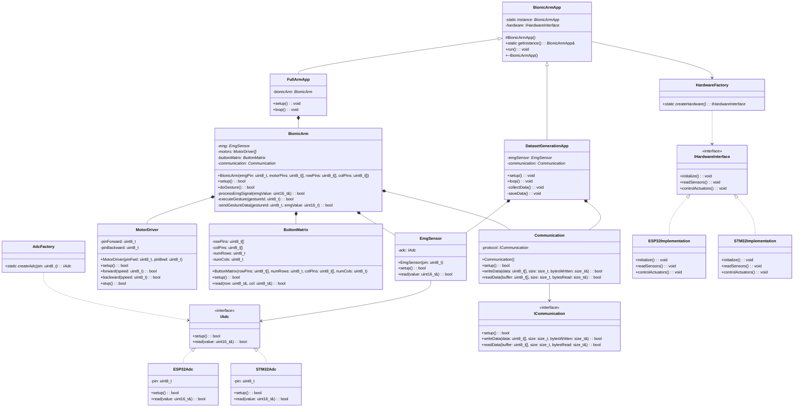

# Bionic Arm Control System

## Overview
This project implements a sophisticated control system for a bionic arm with two main applications:
1. **Full Arm Control**: Complete bionic arm operation and control
2. **EMG Dataset Generation**: Application for collecting and generating EMG (Electromyography) datasets

## Software Architecture

### System Architecture
The system follows a modular, layered architecture designed with scalability, maintainability, reusability, and portability in mind. The architecture is structured as follows:

```
src/
├── Apps/                 # Application layer
│   ├── App.cpp          # Base application class
│   ├── FullArm.cpp      # Full arm control application
│   └── DatasetGeneration.cpp  # EMG dataset generation application
├── Modules/             # Core functionality modules
├── Factories/           # Factory pattern implementations
├── Interfaces/          # Abstract interfaces
├── esp32/              # ESP32 specific implementations
└── stm32/              # STM32 specific implementations
```

### Design Patterns Used

#### 1. Singleton Pattern
- **Implementation**: Used in the base `BionicArmApp` class
- **Purpose**: Ensures only one instance of the application runs at a time
- **Benefits**:
  - Centralized application state management
  - Controlled access to shared resources
  - Memory efficiency

#### 2. Factory Pattern
- **Implementation**: Used for creating hardware-specific components
- **Purpose**: Abstracts the creation of platform-specific implementations
- **Benefits**:
  - Encapsulates object creation logic
  - Enables easy platform switching
  - Supports future hardware additions

### SOLID Principles Implementation

#### 1. Single Responsibility Principle (SRP)
- Each class has one specific responsibility
- Applications are separated into distinct modules
- Clear separation between data collection and arm control functionality

#### 2. Open/Closed Principle (OCP)
- New functionality can be added without modifying existing code
- Platform-specific implementations can be added through interfaces
- Extensible module system for new features

#### 3. Liskov Substitution Principle (LSP)
- Hardware abstractions are properly substitutable
- Platform-specific implementations follow common interfaces
- Consistent behavior across different implementations

#### 4. Interface Segregation Principle (ISP)
- Interfaces are specific to client needs
- Modular design prevents interface pollution
- Clear separation of concerns in the API

#### 5. Dependency Inversion Principle (DIP)
- High-level modules depend on abstractions
- Hardware implementations depend on interfaces
- Loose coupling between components

## Architecture Benefits

### 1. Scalability
- Modular design allows easy addition of new features
- Factory pattern enables support for new hardware platforms
- Independent scaling of data collection and control systems

### 2. Maintainability
- Clear separation of concerns
- Well-defined interfaces
- Organized code structure
- Easy to locate and fix issues

### 3. Reusability
- Common components are abstracted and reusable
- Platform-independent code
- Modular design allows component reuse in other projects

### 4. Portability
- Hardware abstraction layer
- Platform-specific code is isolated
- Easy to port to new microcontrollers

## Current Implementation Status
- Architecture and design patterns implemented
- EMG readings and dataset generation functionality tested
- Framework ready for full arm control implementation

## UML Class Diagram



## UML Diagram Description

The UML class diagram above shows the complete architecture of the Bionic Arm project, including:

1. **Application Layer**
   - Abstract `BionicArmApp` base class (Singleton)
   - Concrete applications: `FullArmApp` and `DatasetGenerationApp`

2. **Core Modules**
   - `BionicArm`: Main control module
   - `EmgSensor`: EMG signal processing
   - `MotorDriver`: Motor control
   - `ButtonMatrix`: Input handling
   - `Communication`: Data transmission

3. **Interfaces**
   - `IHardwareInterface`: Hardware abstraction
   - `IAdc`: ADC operations
   - `ICommunication`: Communication protocols

4. **Factories**
   - `HardwareFactory`: Creates platform-specific implementations
   - `AdcFactory`: Creates ADC implementations

5. **Platform-Specific Implementations**
   - ESP32 implementations
   - STM32 implementations

The diagram shows all relationships between components:
- Inheritance (extends) relationships
- Implementation relationships
- Composition relationships
- Dependencies

This architecture demonstrates the application of:
- SOLID principles
- Factory pattern for hardware abstraction
- Singleton pattern for application management
- Modular design for maintainability and extensibility 

## Testing
- EMG readings functionality has been tested
- Dataset generation system verified
- Ready for further implementation of arm control features 